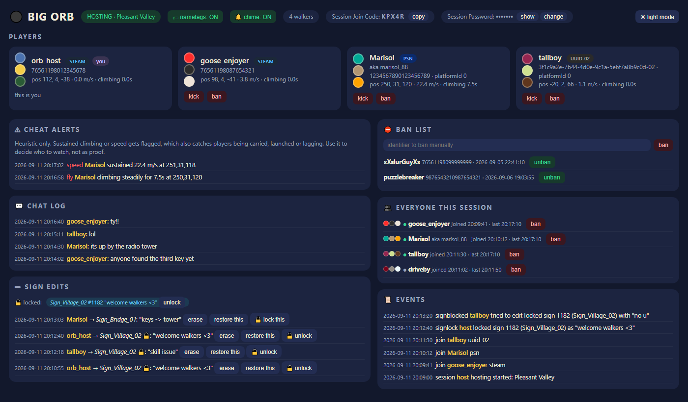
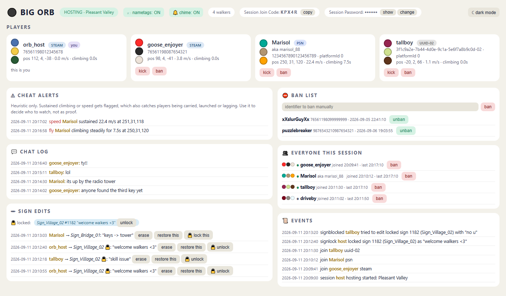

# Big Orb

A small host-side moderation tool for **Big Walk**. It runs as a BepInEx plugin and serves a
dashboard on `http://localhost:7845/` while you host a lobby.



**This is provided as-is. No support, no updates, no promises.** It was written for one
host's own lobbies and published in case it is useful to someone else. If a game update
breaks it, the source is here; fork it.

## What it does

- **Session code and password** in the header: copy the join code, show/change/remove the password
- **Player list** with look colours, platform badge and account identifier
- **Kick** and **ban**. Bans persist and are enforced server-side at the door, before the
  player spawns. A ban records the connection's network identity as well as the account
  identifier, so switching accounts does not get around it. Offline bans from the session
  roster or by pasting an identifier or connection address.
- **Ban list import / export** as CSV, so hosts can share lists. Imports merge; nothing is removed.
- **Modded-client detection.** The identity a client reports (account id, name, platform id,
  Epic id) is whatever its software says; the network identity it connected with is not.
  The two are compared, the network identity is looked up on Epic, and voice traffic is
  rate-limited at the relay. A client caught lying about who it is, logged into Epic with no
  real account behind it, or flooding voice is banned by its connection automatically
  (`guard.autoBan`, on by default). Chat that imitates a system message is dropped.
- **Puzzle reset**: every puzzle back to how it was when the world loaded (pieces, vice, gourd),
  hub reset, black tower finale reset, and a live progress view (gourds turned in, hubs, keys).
- **Item reset**: put items back where they were when the world loaded, near you or everywhere.
- **Chat log** and **sign edit log** with the author of each edit
- **Sign rollback**: erase a sign or restore any earlier text from the log
- **Sign lock**: pin a sign's text so guests' edits are reverted (host can still edit it)
- **Fly / speed alerts** with an optional auto-kick (off by default)
- **Join / leave chime** on the host's machine
- **Local nametags** over other players (only you see them)
- Everything is written to per-session `.jsonl` logs

Only the host is affected. Guests do not need the plugin and nothing is sent to them
beyond the game's own traffic.

Light mode is a click away:



## Install

1. Install [BepInEx 6 (IL2CPP)](https://thunderstore.io/c/big-walk/p/BepInEx/BepInExPack_IL2CPP/)
   for Big Walk, via a mod manager or manually.
2. Drop `BigOrb.dll` from the release into `BepInEx/plugins/BigOrb/`.
3. Start the game. When you begin hosting, the dashboard opens in your browser
   (or open `http://localhost:7845/` yourself).

Built and tested against the Steam build of Big Walk current in September 2026
(Unity 6000.3.17) with BepInEx `6.0.0-be.755`. Other versions may or may not work.

## Config

`BepInEx/config/bigorb.cfg` (created on first run):

| key | default | meaning |
|---|---|---|
| `web.port` | 7845 | dashboard port, localhost only |
| `web.autoOpen` | true | open the dashboard when you start hosting |
| `anticheat.maxSpeed` | 16 | sustained horizontal m/s before a player is flagged |
| `anticheat.maxAirSeconds` | 6 | seconds of steady climbing before a player is flagged |
| `anticheat.autoKick` | false | kick flagged players automatically (off = alert only) |
| `chime.enabled` | true | join/leave chime |
| `chime.volume` | 0.5 | chime volume 0-1 |
| `guard.autoBan` | true | ban the connection of a client proven to be modded (off = alert and disconnect only) |
| `guard.banAnonymousLogins` | true | treat an Epic login with no linked Steam/PSN/Xbox account as a modded client |
| `guard.voicePacketsPerSecond` | 120 | voice packets per second per connection before the rest are dropped (talking is ~50); 0 = off |
| `guard.dropFakeSystemChat` | true | drop guest chat that imitates a system message |

Data lives in `BepInEx/config/BigOrb/`: `bans.json` (one tab-separated line per ban,
last column is the connection address), `eosmap.tsv` (which real account each connection
address turned out to be), `posebaseline_Np.tsv` (where items were when a fresh world loaded)
and `logs/<session>-{chat,signs,alerts,events}.jsonl`.

The ban list ships with one entry: the connection address of a client seen impersonating
players and flooding voice across several hosts' lobbies. Remove it if you disagree.

## Things to know

- The logs contain other players' chat, sign text, names and platform account IDs.
  Treat them accordingly.
- The dashboard is bound to localhost and protected by a per-launch token, so other
  pages in your browser cannot drive it. Anyone with access to your machine can.
- Fly/speed detection is a heuristic on position deltas. It will flag a player being
  carried up a cliff by a friend. Leave `autoKick` off unless you have watched the alerts
  for a while and are happy with them.
- The modded-client checks are not heuristics: a client whose reported Epic id differs from
  the Epic id it connected with, or whose platform id differs from its account id, is running
  something. Every legitimate client seen so far matches on both. An Epic account with no
  linked platform account is an anonymous device login, which the real game never does.
  If you still want a human in the loop, set `guard.autoBan = false`: you get the alert and
  the connection is dropped, nothing is recorded.
- Item and puzzle resets use a baseline of where things were when a *fresh* world loaded.
  A 4-player-world baseline is built in. Other world sizes are captured the first time you host
  them, so host a fresh save once before relying on reset for those.
- Sign locks are per hosting session (network IDs change each time you host).
- A locked sign still shows the guest their own edit on their screen until it
  next syncs; everyone else sees the locked text.

## Building

Requires the .NET 6 SDK and a Big Walk install with BepInEx already run once (the
plugin references the interop assemblies BepInEx generates).

```
set BigWalkBepInEx=C:\path\to\Big Walk\BepInEx
dotnet build -c Release
```

or, for a Thunderstore Mod Manager / r2modman profile:

```
set BigWalkProfile=%APPDATA%\Thunderstore Mod Manager\DataFolder\BigWalk\profiles\<name>
dotnet build -c Release
```

The build copies the DLL into `BepInEx/plugins/BigOrb/` when that folder exists;
pass `-p:SkipDeploy=true` to just build.

## Contributing

See `CONTRIBUTING.md`. Short version: it is unmaintained, forks are welcome, small tested
PRs might get merged.

## License

[CC BY-NC-SA 4.0](https://creativecommons.org/licenses/by-nc-sa/4.0/). In short:

- Use it, change it, share it, for free.
- Credit the original: keep the copyright/licence notice and link back to this repository
  in anything you distribute that is based on it.
- No commercial use. Do not sell it, sell access to it, or ship it as part of any paid
  bundle, pack or service.
- Anything you make from it must be released under this same licence, so it stays free.

Full text in `LICENSE`, short version in `NOTICE`.
